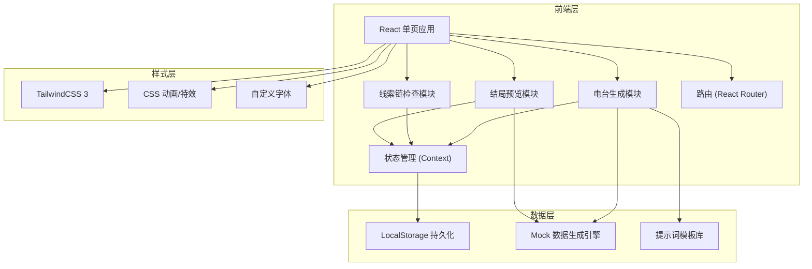
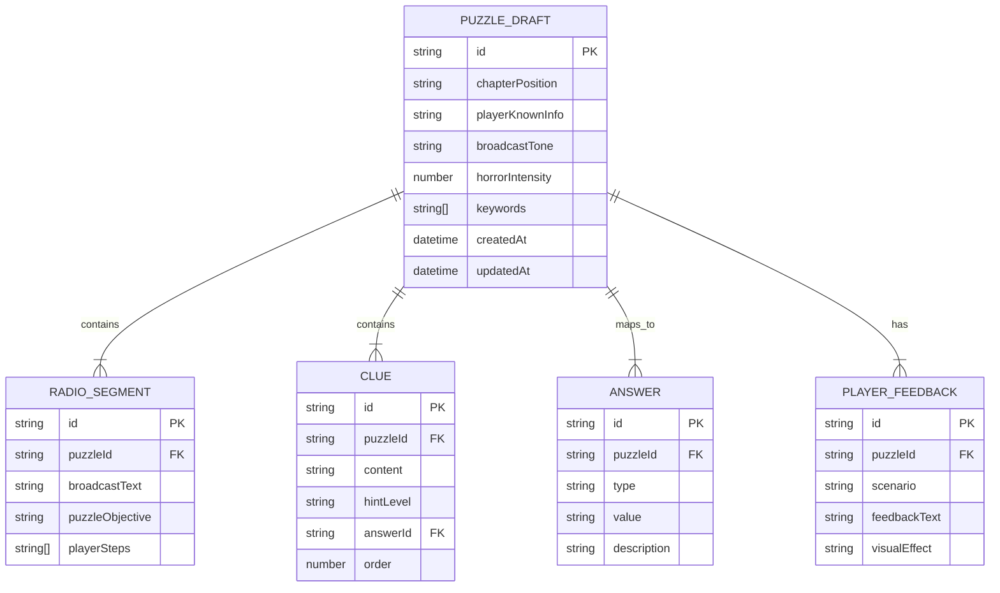

## 1. 架构设计



## 2. 技术描述

- **前端框架**：React 18 + TypeScript
- **构建工具**：Vite 5
- **样式方案**：TailwindCSS 3 + CSS Variables
- **路由管理**：React Router DOM 6
- **状态管理**：React Context + useReducer
- **数据持久化**：LocalStorage
- **图标库**：Lucide React（自定义恐怖风格图标）
- **动画库**：Framer Motion（复杂交互动画）
- **后端**：无（纯前端应用，所有生成逻辑在客户端完成）
- **数据库**：无（使用 LocalStorage 存储草稿）

## 3. 路由定义

| 路由 | 页面 | 目的 |
|------|------|------|
| `/` | 电台谜面生成页 | 参数配置、关键词输入、生成电台文本 |
| `/clues` | 线索链检查页 | 线索提取、答案映射、完整性验证 |
| `/preview` | 结局提示预览页 | 玩家视角模拟、多场景反馈展示 |

## 4. 数据模型

### 4.1 数据模型定义



### 4.2 TypeScript 类型定义

```typescript
interface PuzzleDraft {
  id: string;
  chapterPosition: 'opening' | 'middle' | 'climax' | 'ending';
  playerKnownInfo: string[];
  broadcastTone: 'cold' | 'hysterical' | 'whisper' | 'distorted';
  horrorIntensity: 1 | 2 | 3 | 4 | 5;
  keywords: string[];
  radioSegment?: RadioSegment;
  clues: Clue[];
  answers: Answer[];
  playerFeedback: PlayerFeedback[];
  createdAt: Date;
  updatedAt: Date;
}

interface RadioSegment {
  id: string;
  broadcastText: string;
  puzzleObjective: string;
  playerSteps: string[];
}

interface Clue {
  id: string;
  content: string;
  hintLevel: 'subtle' | 'moderate' | 'obvious';
  answerId?: string;
  order: number;
}

interface Answer {
  id: string;
  type: 'frequency' | 'knob' | 'tape' | 'time' | 'code';
  value: string;
  description: string;
}

interface PlayerFeedback {
  id: string;
  scenario: 'first_listen' | 'repeat_listen' | 'failure' | 'success';
  feedbackText: string;
  visualEffect: string;
}
```

## 5. 核心模块设计

### 5.1 电台生成引擎

基于关键词和参数的模板化生成系统，包含：
- 多种广播口吻的文本模板库
- 恐怖强度对应的内容调整规则
- 线索自动提取算法
- 解谜目标生成逻辑

### 5.2 线索链验证器

- 线索-答案映射关系管理
- 逻辑完整性检查算法
- 缺失线索检测
- 难度平衡评估

### 5.3 预览播放器

- 收音机交互组件
- 文本逐字显示动画
- 多场景状态切换
- 视觉特效控制器

## 6. 性能优化

- 组件懒加载
- 动画使用 CSS transforms 和 opacity
- LocalStorage 操作防抖
- 大文本渲染虚拟化
